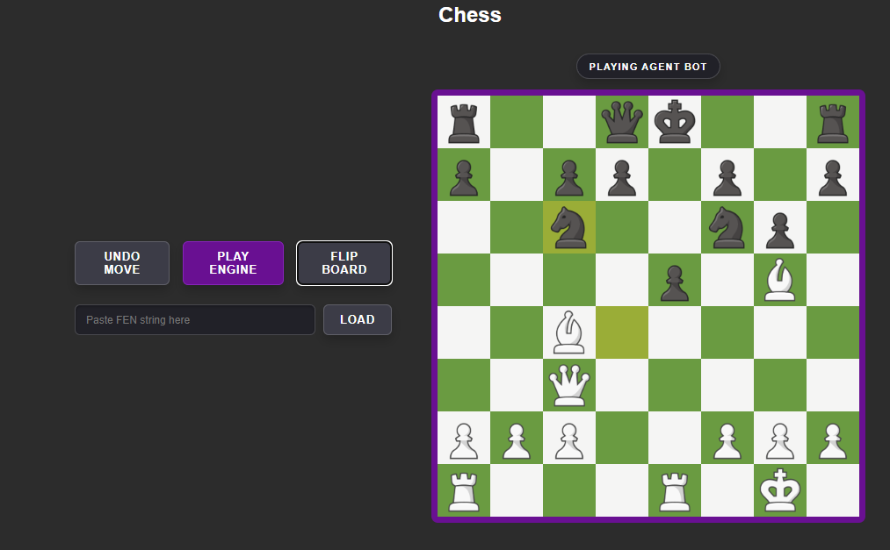

# Chess Engine built with min-max algorithm 


## A chess engine built in Java and Spring Boot with opening book theory, capable of playing chess at an intermediate level.



This project is a chess engine that uses the minimax algorithm and alpha-beta pruning to evaluate future moves. The project can calculate legal moves for each piece and use minimax to explore all permutations of future moves that can be played after a specific move. This project has many other  features.

* **FEN STRING** Load standard FEN (Forsyth-Edwards Notation) string which will set up a specific board state.
* **UNDO BUTTON** A move can be undone and played from the previous position
*  **FLIP BOARD** The board can be flipped when you are playing with a human

 

## How the Engine Works

All the core AI logic lives inside `Engine.java`. I split the problem into two main parts: searching for the best move and evaluating the board state.

### 1. Move Searching (Minimax and Alpha-Beta Pruning)
To look ahead into the future, the engine uses a standard Minimax algorithm. However, because chess has a massive branching factor, computing every single move is too slow. 

To optimize this, I added **Alpha-Beta Pruning**. This allows the engine to immediately skip ("prune") variations that are obviously bad (like hanging a Queen), drastically reducing the number of positions it needs to evaluate.

Here is the core recursive loop:

```java
public int MinMax(int depth, int depthLevel, int alpha, int beta, boolean isMaximizingPlayer) {  
    // Base case: max depth reached or game over
    if (depth == 0 || board.CheckMate || board.StaleMate) {
        return searchAllCaptureMoves(depthLevel, alpha, beta, isMaximizingPlayer);
    }

    // Maximizing player tries to get the highest score possible
    if (isMaximizingPlayer) {
        int maxEval = Integer.MIN_VALUE;
        
        // Simulate all legal moves for the current position
        for (Move move: allCurrentLegalMoves) { 
            board.movePiece(move);
            int eval = MinMax(depth - 1, depthLevel + 1, alpha, beta, false);
            board.UndoMove(); 
            
            maxEval = Math.max(maxEval, eval);
            alpha = Math.max(alpha, eval);
            
            // Alpha-Beta Pruning: cut off this branch if we already found a better route
            if (beta <= alpha) break; 
        }
        return maxEval;
    } 
    // Minimizing player tries to get the lowest score possible
   else{ ... }
}
```
### 2. Board Evaluation
When the engine reaches the end of its search depth, it has to decide who is winning. This is done by the evaluation function, which analyses the board by first checking who has more material value, then analyses positional advantage by using Piece Square Tables  
For example, a Knight in the center of the board is more powerful than a Knight in the corner.
```java
public int[][] Knight_PieceSquareTables_MG = {
    {-50,-40,-30,-30,-30,-30,-40,-50},            // higher number in the center and lower numbers at the corners, which  
    {-40,-20,  0,  0,  0,  0,-20,-40},              // incentivize the engine to put the knight closer to the center.
    {-30,  0, 10, 15, 15, 10,  0, -30},
    {-30,  5, 15, 20, 20, 15,  5,-30},
    {-30,  0, 15, 20, 20, 15,  0, -30},
    {-20,  5, 20, 15, 15, 20,  5, -20},
    {-40,-20,  0,  5,  5,  0,-20,-40},
    {-50,-40,-30,-30,-30,-30,-40,-50}
};
```


# Prerequisites

Before you begin, ensure you have met the following requirements:
* **Java 17** installed.
* Your preferred IDE (VS Code, IntelliJ IDEA, or Eclipse).


## How to run the project

1. Clone this repository to your local machine:
   ```bash
   git clone [https://github.com/Moinul924/Chess_Project.git](https://github.com/Moinul924/Chess_Project.git)
2. Navigate to the project directory:
   ```bash
   cd Chess_Project
3. Run the Spring Boot application
   ``` bash
   mvn spring-boot: run
   ```
   Or you can open the project in your IDE and run the **ChessProjectApplication.java** file.

 4. Open your preferred web browser and navigate to:
      http://localhost:1000/


## Acknowledgments

A special thank you to [Sebastian Lague](https://www.youtube.com/c/SebastianLague) for the inspiration for this project. This work was made possible by his amazing "Chess Coding Adventures" video series, which helped me grasp the mechanics of the minimax algorithm, alpha-beta pruning, and how to improve the evaluation function.
    
